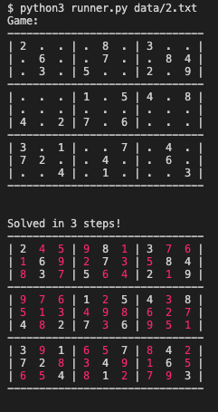

# sudokuSolver
A Python script to solve Sudoku games!

<p align="center">
  
<p>

## Intro
Get a Sudoku game from a txt file (some games available is this repo "data" directory), and run the script that will try to solve it!

## How to run it

- ### **Requirements**

  - [Python 3.x](https://www.python.org/downloads/)
  
1. Clone this repository:

```sh
  $ git clone https://github.com/Alessandro1918/sudokuSolver.git
```

2. Run:

```sh

  $ cd sudoku
  $ python3 runner.py data/game2.txt
```
